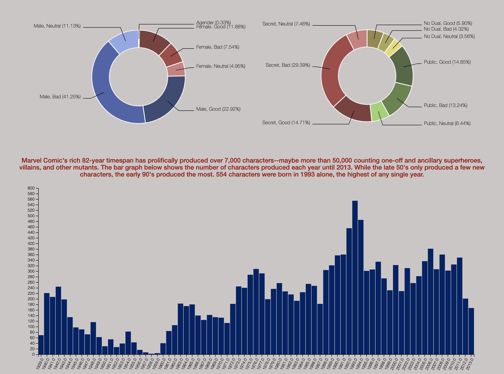
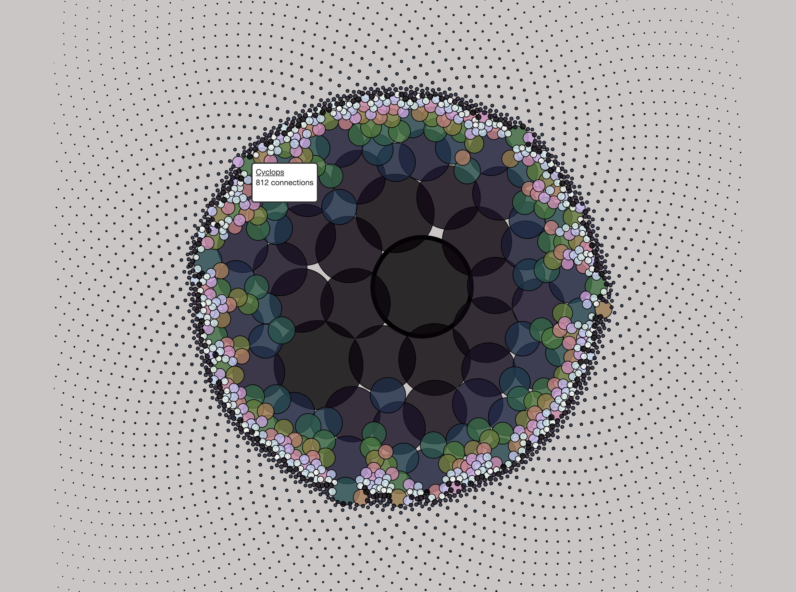

# Project-2  Marvel Universe Data Visualization
## Github Page Link: https://kiranrangaraj.github.io/Project-2/ ##

## SUMMARY ##
* *Overview* *
* *Webpages* *
* *Sources* *
* *Technologies Used* *

## Overview ##
Since its creation in 1939 by Martin Goodman, Marvel Comics has grown into a huge blockbuster entity that creates cinematic renditions of its most famous 
characters whose stories were humbly created in comic books several decades before. The Marvel era officially begain in 1961, when the company launched the The Fantastic Four and superhero titles created by Stan Lee amongst others. Stan Lee is responsible for creating Marvel's most well-known superheroes such as Captain America, Spider-Man, Iron Man, Wolverine, the Hulk, Thor, Ant-Man (Giant), the Wasp, Doctor Strange, Scarlet Witch, Invisible Woman, and Thing. Most of Marvel's fictional characters operate in a single reality known as the Marvel Universe, though this universe has been further depicted as being comprised of a "multiverse" of thousands of separate universes.

This data visualization project delves into the universe, initially looking at its general history, its complex entirity, and then specifics on the 20 most-networked and well-known superheros, as well as what makes them superheroes in the first place. Datasets on character history and demographics were initially obtained from Kaggle and Marvel's official wiki. Databases were then created from the initial CSV files, which employed Python via Jupyter Notebook, Microsoft Excel, and SQL. D3.js was used extensively to create the interactive visualizations seen here via HTML, CSS, and Javascript.

The different tabs sequentially navigate you from one interactive visualization to the next. User prompts are highlighted in red above each visualization.

## Webpages ##
### About ###

Brief historical information regarding character demographics and creation is visualized in donut and bar charts. D3.js was used to generate these diagrams.
12,940 characters were statistically evaluated based on their alignments (good, bad, neutral) versus their gender and identity (public, secret, no dual - no alias/alter ego). The donut charts below illustrate the proportions of this categorical data in the Marvel Universe. Marvel Comic's rich 82-year timespan has prolifically produced over 7,000 characters--maybe more than 50,000 counting one-off and ancillary superheroes, villains, and other mutants. The bar graph below shows the number of characters produced each year until 2013. While the late 50's only produced a few new characters, the early 90's produced the most. 554 characters were born in 1993 alone, the highest of any single year.

### Marvel Universe's Superhero Network ###

Marvel Has Created An Expansive Multiverse that Has Over 7000 Characters. Here we examine who the main characters are based off of the number of other superheroes they are connected to. Kaggle data sets containing data on the individual superhero connections was transformed into a CSV format that was used to create a D3.js force-directed bubble chart. Bubble sizes are proportional to the number of connections each superhero has, enabling immediate viewing of the most-connected superheroes. Mouseover aspects allow each node/bubble character information to be viewed.

## Top 20 Power Grid Comparison ##

Going off of the networking visualization just discussed, the 20 most networked superheroes are looked at in terms of their actual superhero abilities.
The Power Grid is an official ranking system used by Marvel to quantify characters in 7 key areas of prowess: Intelligence, Strength, Speed, Durability, Energy Projection, and Fighting Ability.  In all 7 areas, 1 represents the lowest and 7 the highest rank achievable.
Using D3.js, a radar/spider/web chart was generated from power grid rankings of the top 20 characters. This a two-dimensional chart type designed to plot one or more series of values over multiple quantitative variables. Each variable has its own axis, all axes are joined in the center of the figure. Each character can be selected for individually, and the chart can be adjusted according to specific configuration parameters. Mouseover aspects allow for power grid ranks scores at each node.

## Top 20 Superpower Abilities Comparison ##

What Kinds of Superpowers Do the Top 20 Superheroes have Amongst All of the Superpowers in the Marvel Universe?
Data sets on each superheroes superpowers were utilized to generate this hierarchical edge bundling D3.js visualization. Each top 20 superhero and superpower ability in the Marvel Universe was charted as a node along a circular axis. Source and Target relationships between each superhero and their superpowers was mapped. Hierarchical edge bundling allows to visualize adjacency relations between entities organized in a hierarchy. The idea is to bundle the adjacency edges together to decrease the clutter usually observed in complex networks. 

## Sources ##
Data Sets Used:
* https://www.kaggle.com/dannielr/marvel-superheroes?select=charcters_stats.csv
* https://www.kaggle.com/fivethirtyeight/fivethirtyeight-comic-characters-dataset?select=marvel-wikia-data.csv
* https://marvel.fandom.com/wiki/Power_Grid

Marvel Images:
* https://img.wallpapersafari.com/desktop/1920/1080/44/13/g1NGvx.jpg
* https://wallpaperset.com/w/full/d/6/8/526989.jpg

## Technologies used ##
* HTML 5
* CSS 3
* Javascript
* Bootstrap
* D3.json
* D3-tip.js
* CSV file
* SQL
* Python
* Microsoft Excel

## Author ##
* Kiran Rangaraj - Data Analytics Bootcamp - Vanderbilt University - 2021
